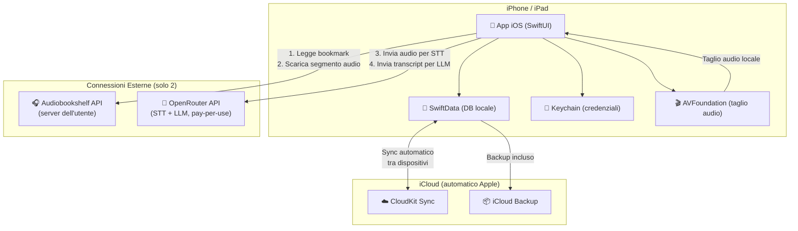
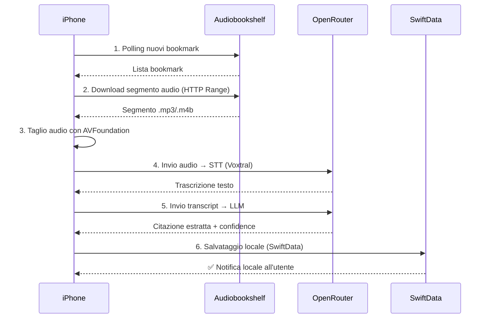
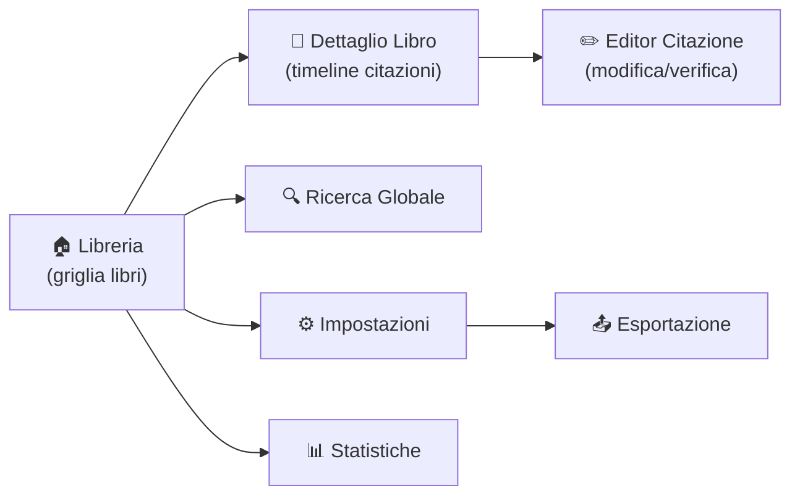

# 📱 AudiobookNotes iOS — Progetto Completo di Trasformazione

## 1. Analisi dell'App Attuale

### Cosa fa oggi AudiobookNotes

| Componente | Tecnologia | Funzione |
|---|---|---|
| **Backend** | Python 3.12 + FastAPI + Uvicorn | Polling ABS, pipeline elaborazione, API REST |
| **Trascrizione** | OpenRouter → Voxtral Mini | Speech-to-Text dei segmenti audio |
| **Analisi AI** | OpenRouter → Auto (LLM) | Estrazione citazione verbatim dal transcript |
| **Audio** | ffmpeg (in Docker) | Download Range HTTP + taglio segmento audio |
| **Storage** | File JSON locali | Un file per libro con tutte le citazioni |
| **Frontend** | HTML/CSS/JS vanilla (dark mode) | Dashboard web su porta 7777 |
| **Deploy** | Docker + docker-compose | Container autonomo accanto ad ABS |

### Punti di Forza da Preservare
- ✅ Workflow automatico: bookmark → audio → trascrizione → citazione AI
- ✅ Nessun intervento manuale richiesto (solo piazzare il bookmark)
- ✅ Esportazione in JSON e CSV Readwise
- ✅ Sistema di confidence (High/Medium/Low)
- ✅ Possibilità di verifica e correzione manuale
- ✅ Rielaborazione con finestra audio espansa (+20%)

### Limiti Attuali (Opportunità per iOS)
- ❌ Richiede Docker + terminale → nessun utente non-tecnico lo userebbe
- ❌ Dipende da un server Audiobookshelf self-hosted
- ❌ Nessuna notifica (push o locale)
- ❌ Nessun sync tra dispositivi
- ❌ Nessuna esperienza mobile nativa
- ❌ Nessuna integrazione con l'ecosistema Apple (Siri, Widget, Share Sheet)

---

## 2. Verdetto: Si Può Fare? 

### ✅ Sì, assolutamente — ma con una trasformazione architetturale significativa

L'app ha un **concept forte e originale**: trasformare un semplice gesto (premere bookmark) in una libreria strutturata di citazioni grazie all'AI. Questo è un **valore unico** che su App Store non ha competitori diretti.

### Sfide Tecniche Principali

| Sfida | Soluzione Proposta |
|---|---|
| **ffmpeg non esiste su iOS** | `AVFoundation` nativo per il taglio audio + HTTP Range Request per scaricare solo il segmento necessario |
| **Polling continuo non è possibile su iOS** | Background App Refresh di Apple + BGProcessingTask + Notifiche locali |
| **File JSON locali non scalano** | `SwiftData` (database locale nativo) con sync automatico via `iCloud/CloudKit` |
| **L'utente deve avere ABS self-hosted** | Mantenere come requisito, rendere la configurazione semplicissima (QR code per le credenziali) |
| **Minimizzare dipendenze esterne** | Architettura "device-first": tutto gira e si salva su iPhone, solo OpenRouter richiede rete |

---

## 3. Strategia Architetturale Proposta

### Architettura "Device-First": Zero Backend, Tutto su iPhone

> [!IMPORTANT]
> **Principio guida**: l'app non dipende da nessun server che l'utente debba mantenere (oltre al proprio ABS). Niente Firebase, niente Cloud Functions, niente VPS. Solo due connessioni esterne: **il server ABS dell'utente** (già esistente) e **OpenRouter** (pay-per-use, nessun server da gestire).



### Flusso di elaborazione on-device



### Perché questa architettura?

| Aspetto | Vantaggio |
|---|---|
| **Zero costi server** | Nessun Firebase, nessun VPS, nessuna Cloud Function da pagare |
| **Zero manutenzione** | L'utente non deve gestire nessun server aggiuntivo |
| **Privacy** | I dati restano sul dispositivo dell'utente + iCloud personale |
| **Offline** | Lettura, ricerca, modifica citazioni funzionano senza internet |
| **Sync gratis** | iCloud sincronizza automaticamente tra iPhone e iPad |
| **Semplicità** | Solo 2 credenziali da configurare: URL ABS + chiave OpenRouter |

### Cosa NON si può fare on-device

> [!NOTE]
> **Trascrizione (STT) e Analisi AI (LLM)** richiedono necessariamente una connessione a OpenRouter. I modelli AI generativi di qualità sufficiente non possono girare localmente su iPhone. Tuttavia OpenRouter è un servizio pay-per-use: l'utente paga solo per ciò che usa, senza server da gestire. In futuro, se Apple potenziasse i modelli on-device con Apple Intelligence, potremmo valutare alternative locali per funzionalità base.

---

## 4. Funzionalità dell'App iOS

### 4.1 — Core (MVP — Versione 1.0)

#### 📚 Libreria Personale
- Vista a griglia/lista dei libri con copertine (scaricate da ABS o Open Library API)
- Contatore citazioni per libro
- Ordinamento per: ultimo aggiornamento, titolo, autore, numero citazioni

#### 💬 Timeline Citazioni
- Vista timeline cronologica per libro (come la dashboard web attuale ma nativa)
- Badge di confidence colorati (🟢 High, 🟡 Medium, 🔴 Low)
- Tap per espandere → mostra trascrizione originale + reasoning AI
- Swipe per azioni rapide: modifica, elimina, condividi

#### ✏️ Editor Citazione
- Modifica in-place del testo della citazione
- Salvataggio con promozione automatica a "High" confidence
- Pulsante "Rielabora con +20% audio" con feedback visivo

#### ⚙️ Setup Guidato (Onboarding)
- Wizard passo-passo per connettere il proprio server ABS
- Scansione QR code per importare URL + Token ABS
- Test di connessione in tempo reale con feedback visivo
- Setup chiave API OpenRouter con link diretto alla pagina di registrazione

#### 🔄 Sync e Polling
- Pull-to-refresh manuale
- Background App Refresh per polling automatico (con limiti iOS)
- BGProcessingTask per elaborazione bookmark in background
- Indicatore di stato connessione al server ABS
- Sync automatico tra dispositivi via iCloud/CloudKit

---

### 4.2 — Funzionalità Premium (Versione 1.5)

#### 🔔 Notifiche Locali
- "Nuova citazione estratta dal libro *Il Nome della Rosa*"
- Tap sulla notifica → apre direttamente la citazione
- Generate localmente dall'app al completamento dell'elaborazione (nessun server richiesto)

#### 🔍 Ricerca Full-Text
- Ricerca istantanea su tutte le citazioni di tutti i libri
- Filtri combinabili: libro, confidence, data, parole chiave
- Risultati evidenziati con highlight del termine cercato

#### 🏷️ Tag e Categorie
- Aggiunta di tag personalizzati alle citazioni (es. "filosofia", "motivazione", "scrittura")
- Filtro per tag nella libreria
- Suggerimento automatico di tag tramite AI

#### 📤 Esportazione Avanzata
- **Readwise CSV** (già presente, portato su iOS)
- **Markdown** (per Obsidian, Notion, Bear)
- **Apple Notes** (integrazione diretta via Share Sheet)
- **Kindle Highlights format** (per chi usa anche Kindle)
- **PDF stilizzato** con copertina e indice per libro

#### 🎨 Widget iOS
- Widget piccolo: ultima citazione aggiunta (testo + libro)
- Widget medio: 3 citazioni random della settimana ("Citazione del giorno")
- Widget grande: statistiche libreria (libri, citazioni totali, libro più annotato)

---

### 4.3 — Funzionalità Differenzianti (Versione 2.0)

#### 🧠 AI Insights
- **Riassunto AI del libro** basato su tutte le citazioni raccolte
- **Temi ricorrenti**: clustering delle citazioni per argomento
- **Connessioni tra libri**: "Questa citazione di *Sapiens* richiama un concetto di *Thinking Fast and Slow*"
- **Flashcard automatiche**: genera coppie domanda/risposta dalle citazioni per studio spaziale

#### 🗣️ Siri Shortcuts
- "Ehi Siri, leggimi una citazione random"
- "Ehi Siri, quante citazioni ho dal libro X?"
- "Ehi Siri, aggiungi un tag 'filosofia' all'ultima citazione"

#### 🎵 Player Audio Integrato
- Riascolta il segmento audio originale della citazione direttamente dall'app
- Utile per verificare la trascrizione senza tornare ad ABS
- Controlli: play/pause, velocità, skip ±5s

#### 📊 Statistiche e Gamification
- Grafico della frequenza di lettura/annotazione nel tempo
- "Streak" di giorni consecutivi con almeno una citazione
- Obiettivi settimanali/mensili personalizzabili
- Badge di achievement (es. "100 citazioni", "10 libri annotati")

#### 🌍 Social / Community (Opzionale)
- Condivisione citazione su social con card grafica generata automaticamente
- Profilo pubblico con citazioni preferite (opt-in)
- Feed "Scopri" con citazioni popolari di altri utenti (se consentito)

---

## 5. Stack Tecnologico iOS

| Layer | Tecnologia | Motivazione |
|---|---|---|
| **UI** | SwiftUI | Framework nativo Apple, moderno, dichiarativo |
| **Architettura** | MVVM + Coordinator | Separazione UI/logica/navigazione, testabile |
| **Networking** | URLSession nativo | Zero dipendenze, supporto async/await |
| **Database Locale** | SwiftData | Persistenza nativa Apple, sync iCloud gratis, zero setup |
| **Sync Multi-Device** | iCloud / CloudKit | Sync automatico tra iPhone e iPad, zero server |
| **Sicurezza Credenziali** | Keychain Services | Storage crittografato per token ABS e chiave OpenRouter |
| **Elaborazione Audio** | AVFoundation | Taglio audio nativo, nessun ffmpeg necessario |
| **Notifiche** | UNUserNotificationCenter | Notifiche locali, nessun server push richiesto |
| **Background Tasks** | BGTaskScheduler | Polling ABS e elaborazione in background |
| **Analytics** | Xcode Organizer + OSLog | Crash report e metriche senza dipendenze esterne |
| **In-App Purchase** | StoreKit 2 | Gestione abbonamenti nativa Apple |
| **AI on-device** | Core ML (futuro) | Per classificazione tag offline |

> [!TIP]
> **Zero dipendenze esterne**: l'intero stack utilizza solo framework nativi Apple. Nessuna libreria di terze parti necessaria per il funzionamento base. Questo significa: nessun CocoaPods, nessun SPM package obbligatorio, build più veloci e nessun rischio di breaking changes da librerie esterne.

### Struttura del Progetto Xcode

```
AudiobookNotesApp/
├── App/
│   ├── AudiobookNotesApp.swift          # Entry point
│   ├── AppCoordinator.swift             # Navigazione globale
│   └── BackgroundTaskManager.swift      # Registrazione BGTask
├── Core/
│   ├── Models/
│   │   ├── Book.swift                   # @Model SwiftData - libro
│   │   ├── Quote.swift                  # @Model SwiftData - citazione
│   │   ├── Bookmark.swift               # @Model SwiftData - bookmark ABS
│   │   └── ProcessingJob.swift          # @Model SwiftData - job in coda
│   ├── Networking/
│   │   ├── ABSClient.swift              # Client Audiobookshelf (URLSession)
│   │   ├── OpenRouterClient.swift       # Client OpenRouter (URLSession)
│   │   └── NetworkMonitor.swift         # Monitoraggio connettività (NWPathMonitor)
│   ├── Persistence/
│   │   ├── SwiftDataContainer.swift     # Configurazione ModelContainer + iCloud
│   │   └── KeychainManager.swift        # CRUD credenziali nel Keychain
│   ├── Audio/
│   │   └── AudioSegmentProcessor.swift  # Taglio audio con AVFoundation
│   └── Services/
│       ├── BookmarkPollingService.swift  # Polling nuovi bookmark da ABS
│       ├── TranscriptionService.swift   # Invio audio → OpenRouter STT
│       ├── QuoteExtractionService.swift # Invio transcript → OpenRouter LLM
│       ├── PipelineCoordinator.swift    # Orchestrazione pipeline completa
│       └── LocalNotificationManager.swift # Notifiche locali completamento
├── Features/
│   ├── Onboarding/
│   │   ├── OnboardingView.swift
│   │   ├── OnboardingViewModel.swift
│   │   └── ConnectionTestManager.swift  # Test connessione ABS
│   ├── Library/
│   │   ├── LibraryView.swift
│   │   └── LibraryViewModel.swift
│   ├── BookDetail/
│   │   ├── BookDetailView.swift
│   │   ├── QuoteTimelineView.swift
│   │   └── BookDetailViewModel.swift
│   ├── QuoteEditor/
│   │   ├── QuoteEditorView.swift
│   │   └── QuoteEditorViewModel.swift
│   ├── Search/
│   │   ├── SearchView.swift
│   │   └── SearchViewModel.swift
│   ├── Export/
│   │   ├── ExportView.swift
│   │   └── ExportCoordinator.swift      # Genera CSV, MD, PDF localmente
│   └── Settings/
│       ├── SettingsView.swift
│       └── SettingsViewModel.swift
├── SharedUI/
│   ├── Components/
│   │   ├── ConfidenceBadge.swift
│   │   ├── QuoteCard.swift
│   │   ├── BookCoverView.swift
│   │   └── EmptyStateView.swift
│   ├── Theme/
│   │   ├── ColorPalette.swift
│   │   └── Typography.swift
│   └── Modifiers/
│       └── CardModifier.swift
├── Widgets/
│   ├── QuoteOfTheDayWidget.swift
│   └── LibraryStatsWidget.swift
└── Resources/
    ├── Assets.xcassets
    └── Localizable.strings (it, en)
```

---

## 6. Design UX / UI

### Filosofia di Design
- **Dark mode nativo** come default (coerente con l'app attuale)
- **Glassmorphism sottile** per le card delle citazioni
- **Animazioni fluide** con spring animations di SwiftUI
- **Tipografia**: SF Pro (sistema) per il corpo, serif (New York) per le citazioni
- **Palette colori**: toni caldi ambra/oro su sfondo scuro (richiama il concetto di "sapienza" e libri antichi)

### Palette Colori Proposta

| Ruolo | Colore | Hex |
|---|---|---|
| Background primario | Nero profondo | `#0D0D0D` |
| Background card | Grigio antracite | `#1A1A2E` |
| Accento primario | Ambra dorato | `#F5A623` |
| Accento secondario | Bronzo caldo | `#C77B30` |
| Testo primario | Bianco caldo | `#F0E6D3` |
| Testo secondario | Grigio sabbia | `#8A8577` |
| Confidence High | Verde smeraldo | `#2ECC71` |
| Confidence Medium | Giallo miele | `#F1C40F` |
| Confidence Low | Rosso corallo | `#E74C3C` |

### Schermate Principali



---

## 7. Modello di Monetizzazione

### Strategia: Freemium con Abbonamento

> [!TIP]
> Il modello freemium è il più efficace per app di nicchia: acquisire utenti gratis, convertire quelli che trovano valore reale nel prodotto.

#### 🆓 Piano Gratuito
- Connessione a 1 server Audiobookshelf
- Fino a **3 libri** con citazioni
- Fino a **50 citazioni totali**
- Esportazione JSON base
- Tema dark di default
- Nessun widget, nessun tag, nessun AI Insights

#### ⭐ Piano Pro — €4.99/mese o €39.99/anno
- Libri e citazioni **illimitati**
- Esportazione in tutti i formati (CSV Readwise, Markdown, PDF, Apple Notes)
- Tag personalizzati con suggerimento AI
- Ricerca full-text avanzata
- Widget iOS (tutti e 3)
- Siri Shortcuts
- Temi aggiuntivi (Light mode, Sepia, custom)

#### 🚀 Piano Ultimate — €9.99/mese o €79.99/anno
- Tutto di Pro +
- **AI Insights**: riassunti, temi, connessioni tra libri
- **Flashcard automatiche** con ripetizione spaziata
- **Player audio** integrato per riascoltare i segmenti
- **Backup cloud** delle citazioni
- **Accesso anticipato** a nuove funzionalità
- Supporto prioritario

#### 💰 Proiezione Ricavi (conservativa)

| Metrica | Stima |
|---|---|
| Download primo anno | 5.000 — 15.000 |
| Tasso conversione a Pro | 5-8% |
| Tasso conversione a Ultimate | 1-2% |
| ARPU (ricavo medio per utente pagante) | ~€50/anno |
| Ricavo annuo stimato (range) | €12.500 — €120.000 |

> [!NOTE]
> Queste stime sono conservative per un'app di nicchia. Il mercato degli audiolibri è in forte crescita (Audible ha 100M+ utenti). Anche una piccolissima fetta è profittevole dato il basso costo operativo.

---

## 8. Requisiti per l'Apple Store

### 8.1 — Requisiti Tecnici Obbligatori

| Requisito | Stato | Note |
|---|---|---|
| Supporto iOS 17+ | ✅ Da implementare | SwiftUI 5 + SwiftData |
| Supporto iPhone + iPad | ✅ Da implementare | Layout adattivo |
| Dark Mode nativo | ✅ Già nel DNA dell'app | |
| Privacy Manifest | ⚠️ Necessario | Dichiarare uso rete verso ABS e OpenRouter |
| App Transport Security | ✅ | HTTPS obbligatorio (ABS potrebbe essere HTTP locale → eccezione ATS necessaria) |
| Accessibility (VoiceOver) | ⚠️ Da implementare | Obbligatorio per approvazione |
| Localizzazione | ✅ Italiano + Inglese | |
| iCloud Entitlement | ✅ Da configurare | Per sync SwiftData tra dispositivi |

### 8.2 — Requisiti Legali

- **Privacy Policy** (obbligatoria): dichiarare che i dati restano sul dispositivo, uso API OpenRouter per elaborazione AI
- **Terms of Service**: l'utente è responsabile della propria chiave OpenRouter e dei costi associati
- **GDPR Compliance**: semplificata — i dati sono locali sul dispositivo dell'utente, nessun dato raccolto da noi
- **EULA**: standard Apple

### 8.3 — Potenziali Motivi di Rifiuto da Prevenire

> [!WARNING]
> Apple è molto severa. Queste sono le trappole più comuni:

1. **"L'app è solo un wrapper di un sito web"** → Soluzione: app 100% nativa SwiftUI, nessuna WebView
2. **"L'app richiede un servizio esterno per funzionare"** → Soluzione: l'app funziona offline per lettura/ricerca/modifica citazioni. ABS e OpenRouter servono solo per l'elaborazione di nuovi bookmark. Modalità demo con dati di esempio inclusa
3. **"L'utente deve pagare un servizio terzo (OpenRouter)"** → Soluzione: includere un bundle di crediti gratuiti nel piano gratuito, o valutare modelli on-device via Core ML per funzionalità base
4. **"In-App Purchase non correttamente implementato"** → Soluzione: usare StoreKit 2 con validazione locale (nessun server-side necessario)

---

## 9. Integrazioni Strategiche

### 9.1 — Readwise (Già Supportata)
- Esportazione CSV compatibile al 100%
- **Upgrade iOS**: integrazione diretta via Readwise API per sync automatico

### 9.2 — Obsidian / Notion
- Esportazione in Markdown con frontmatter YAML
- Template personalizzabile dall'utente
- Deep link per aprire la nota direttamente in Obsidian

### 9.3 — Apple Books (Futuro)
- Se Apple espone API per i bookmark di Apple Books → supporto diretto come alternativa ad ABS
- Attualmente non esistono API pubbliche, ma è un'area da monitorare

### 9.4 — Audible (Futuro, Complesso)
- Audible non ha API pubbliche
- Possibile via Whispersync/scraping con consenso utente
- Rischio TOS violation → da valutare con cautela

### 9.5 — Spotify Audiobooks (Futuro)
- Spotify ha un catalogo audiolibri in crescita
- Nessuna API bookmark al momento
- Monitorare evoluzione della Spotify API

---

## 10. Analisi Competitiva

| App | Cosa fa | Differenza con AudiobookNotes |
|---|---|---|
| **Readwise** | Aggrega highlight da Kindle, articoli, PDF | Non supporta audiolibri, non fa trascrizione |
| **Audible** | Player audiolibri con clip e note | Le clip sono manuali, non c'è AI extraction |
| **Bookly** | Tracking lettura, statistiche | Solo libri fisici/ebook, zero audiolibri |
| **Highlighter** | Cattura citazioni da foto/OCR | Solo testo visivo, non audio |
| **AudiobookNotes** | **AI-powered verbatim quote extraction da audiolibri** | **UNICO nel mercato** |

> [!IMPORTANT]
> **Posizionamento unico**: AudiobookNotes è l'unica soluzione che trasforma un bookmark audio in una citazione testuale precisa grazie all'AI. Questo è un vantaggio competitivo fortissimo da comunicare nel marketing.

---

## 11. Roadmap di Sviluppo

### Fase 0 — Preparazione (1-2 settimane)
- [ ] Creare account Apple Developer (€99/anno)
- [ ] Setup progetto Xcode con architettura MVVM + SwiftData
- [ ] Configurare iCloud entitlement per sync tra dispositivi
- [ ] Definire modelli SwiftData (Book, Quote, Bookmark, ProcessingJob)
- [ ] Implementare KeychainManager per storage credenziali

### Fase 1 — MVP (8-10 settimane)
- [ ] Onboarding con setup ABS (QR code) e chiave OpenRouter
- [ ] ABSClient: connessione diretta dall'iPhone al server ABS dell'utente
- [ ] AudioSegmentProcessor: download e taglio audio con AVFoundation
- [ ] Pipeline on-device: bookmark → audio → STT (OpenRouter) → LLM (OpenRouter) → citazione
- [ ] Libreria libri con copertine
- [ ] Timeline citazioni per libro
- [ ] Editor citazione con salvataggio
- [ ] Rielaborazione singola citazione
- [ ] Pull-to-refresh + BGProcessingTask per polling automatico
- [ ] Notifiche locali al completamento elaborazione
- [ ] Dark mode nativo
- [ ] Accessibilità base (VoiceOver)
- [ ] Localizzazione IT + EN

### Fase 2 — Pro Features (6-8 settimane)
- [ ] Ricerca full-text con SwiftData queries
- [ ] Tag e categorie
- [ ] Esportazione multi-formato (CSV, Markdown, PDF — tutto generato localmente)
- [ ] Widget iOS (leggono da SwiftData via App Groups)
- [ ] In-App Purchase (StoreKit 2 con validazione locale)
- [ ] Siri Shortcuts base

### Fase 3 — AI & Premium (6-8 settimane)
- [ ] AI Insights (riassunti, temi, connessioni — via OpenRouter)
- [ ] Flashcard con ripetizione spaziata (storage locale SwiftData)
- [ ] Player audio integrato (AVFoundation, streaming da ABS)
- [ ] Statistiche e gamification (calcoli locali su SwiftData)
- [ ] Supporto iPad con layout ottimizzato

### Fase 4 — Social & Growth (4-6 settimane)
- [ ] Card citazione condivisibile su social
- [ ] Profilo pubblico opt-in
- [ ] Integrazione diretta Readwise API
- [ ] Integrazione Obsidian (URL scheme)
- [ ] Onboarding video tutorial

---

## 12. Stima dei Costi

### Costi di Sviluppo

| Voce | Stima | Note |
|---|---|---|
| Account Apple Developer | €99/anno | Obbligatorio |
| Sviluppo MVP (se freelancer) | €8.000 - €15.000 | 8-10 settimane di lavoro |
| Sviluppo MVP (se fai da te con AI) | €0 (tempo) | Con Gemini/Claude come copilota |
| Design professionale (opzionale) | €1.500 - €3.000 | Per schermate marketing e icona |
| ~~Firebase~~ | ~~€0 - €50/mese~~ | **ELIMINATO — non più necessario** |

### Costi Operativi Mensili (post-lancio)

| Voce | Costo | Note |
|---|---|---|
| Apple Developer | €8.25/mese | Annuale |
| iCloud (sync SwiftData) | €0 | Incluso nell'account Apple Developer |
| OpenRouter (per utente) | Pagato dall'utente | Nessun costo per te |
| Server / Backend | €0 | **Nessun server da mantenere** |
| Support/Manutenzione | 5-10h/mese | Bug fix, review risposte, aggiornamenti iOS |

> [!TIP]
> **Costo totale stimato per il lancio MVP**: €99 (Apple) + tuo tempo. **Zero costi ricorrenti** per server o servizi cloud. L'unico costo è l'account Apple Developer annuale. OpenRouter è pagato direttamente dagli utenti con le proprie chiavi API.

---

## 13. Decisione Strategica: Swift Nativo vs Flutter/React Native

| Criterio | Swift Nativo | Flutter | React Native |
|---|---|---|---|
| Performance | ⭐⭐⭐⭐⭐ | ⭐⭐⭐⭐ | ⭐⭐⭐ |
| Integrazione iOS (Widget, Siri, etc.) | ⭐⭐⭐⭐⭐ | ⭐⭐ | ⭐⭐ |
| Curva di apprendimento per te | ⭐⭐ (nuovo linguaggio) | ⭐⭐⭐ (Dart) | ⭐⭐⭐⭐ (JS che conosci già) |
| Approvazione Apple Store | ⭐⭐⭐⭐⭐ | ⭐⭐⭐⭐ | ⭐⭐⭐ |
| Multi-piattaforma (Android futuro) | ❌ Solo iOS | ✅ iOS + Android | ✅ iOS + Android |
| Modernità stack | SwiftUI è il futuro | Maturo | In declino relativo |

### Raccomandazione: **Swift Nativo (SwiftUI)**

> [!IMPORTANT]
> Per un'app che vuole integrarsi profondamente con l'ecosistema Apple (Widget, Siri, ShareSheet, **iCloud sync nativo con SwiftData**, Apple Watch futuro), Swift nativo è la scelta obbligata. L'architettura device-first con iCloud sync è possibile SOLO con framework nativi. Se in futuro vuoi Android, potrai creare un client Android separato che legge dallo stesso server ABS.

---

## 14. Rischi e Mitigazioni

| Rischio | Probabilità | Impatto | Mitigazione |
|---|---|---|---|
| Apple rifiuta l'app per dipendenza da servizio esterno (ABS) | Media | Alto | Modalità demo con dati di esempio, valore offline completo (lettura/ricerca/modifica senza rete) |
| Audiobookshelf cambia API | Bassa | Medio | Astrazione del client API (protocollo Swift), versionamento |
| OpenRouter cambia pricing/API | Media | Medio | Supporto multi-provider (OpenAI diretto, Anthropic, Groq) — basta cambiare endpoint |
| Limiti iOS per background processing | Media | Medio | BGProcessingTask + coda locale (ProcessingJob) che riprende al prossimo avvio app |
| Taglio audio pesante su iPhone | Bassa | Basso | HTTP Range Request per scaricare solo il segmento necessario, minimizzando I/O |
| Mercato troppo di nicchia | Media | Medio | Espandere oltre ABS (Apple Books, Audible) |
| Complessità tecnica troppo alta | Media | Alto | Procedere per fasi MVP, validare con beta tester |

---

## 15. Prossimi Passi Concreti

Se decidi di procedere, ecco i primi 5 passi:

1. **Registrati all'Apple Developer Program** (€99/anno) — serve per testare su device reale e pubblicare
2. **Installa Xcode** e crea un progetto SwiftUI vuoto con l'architettura proposta sopra
3. **Configura iCloud entitlement** nel progetto Xcode per abilitare sync SwiftData tra dispositivi
4. **Esponi il tuo server ABS via HTTPS** (Tailscale o Cloudflare Tunnel sono gratuiti) — così l'iPhone può raggiungerlo anche fuori dalla rete locale
5. **Sviluppa il primo screen**: l'Onboarding con setup ABS + test di connessione diretta dall'iPhone

> [!NOTE]
> Posso guidarti passo-passo in ogni fase. Dato che non sei un programmatore, la strategia sarà: io scrivo il codice Swift, tu testi su iPhone e mi dici cosa non funziona o cosa vuoi cambiare. Lo stesso flusso che usiamo oggi con Python.

---

## 16. Conclusione

**AudiobookNotes ha un concept forte, originale e senza concorrenti diretti.** La trasformazione in app iOS è non solo fattibile, ma ha un potenziale commerciale reale. Il mercato degli audiolibri è in forte crescita, e nessun competitor offre estrazione AI automatica di citazioni da bookmark audio.

L'architettura **"device-first"** rende l'app:
1. **Indipendente** — nessun server da mantenere, zero costi ricorrenti
2. **Privata** — tutti i dati restano sul dispositivo dell'utente
3. **Semplice** — solo 2 credenziali da configurare (ABS + OpenRouter)
4. **Resiliente** — funziona offline per lettura/ricerca, si sincronizza via iCloud

La chiave del successo sarà:
1. **Un'esperienza utente premium** che giustifichi il prezzo dell'abbonamento
2. **Un onboarding semplicissimo** che non spaventi gli utenti non-tecnici
3. **Funzionalità AI differenzianti** che nessun competitor può replicare facilmente
4. **Iterazione veloce** basata sul feedback dei primi utenti beta

Il viaggio da "script Docker per uso personale" a "prodotto su App Store" è lungo ma entusiasmante. E il fatto che l'app sia già perfettamente funzionante significa che la parte più difficile — la logica di business — è già risolta. 🚀
